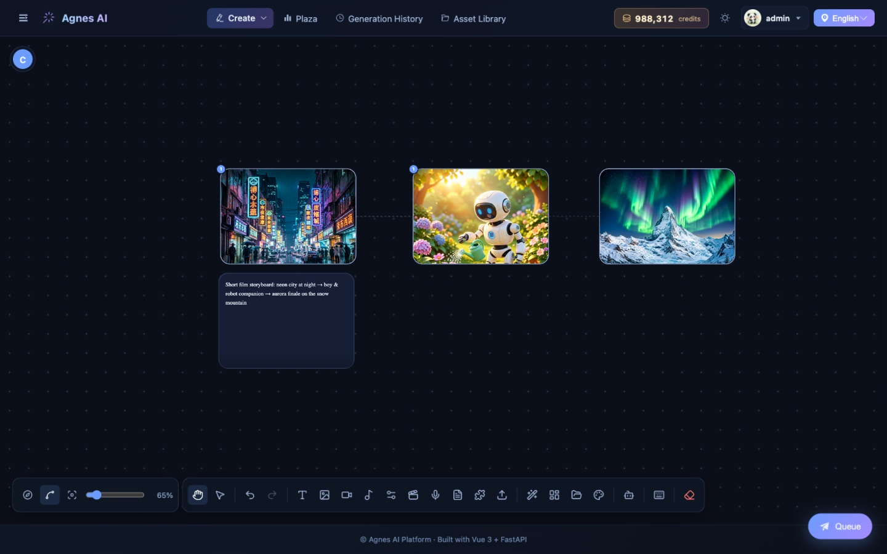
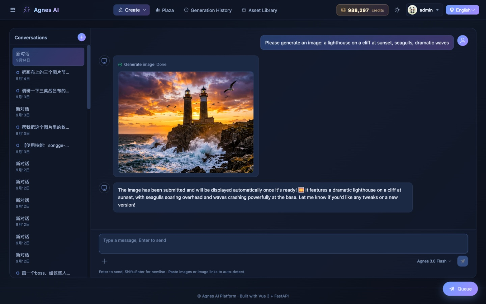
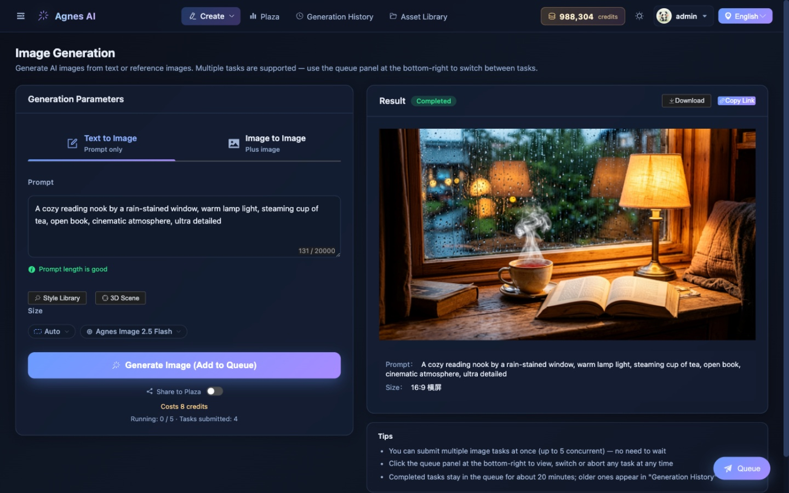
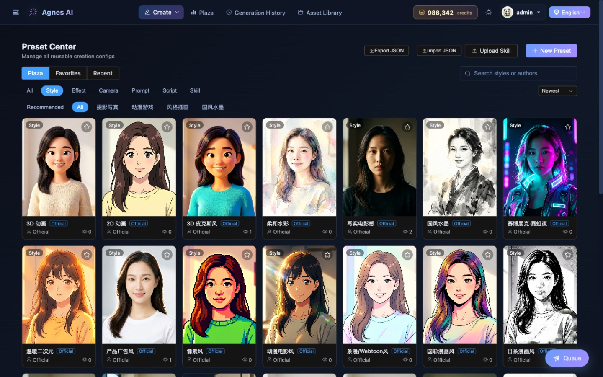
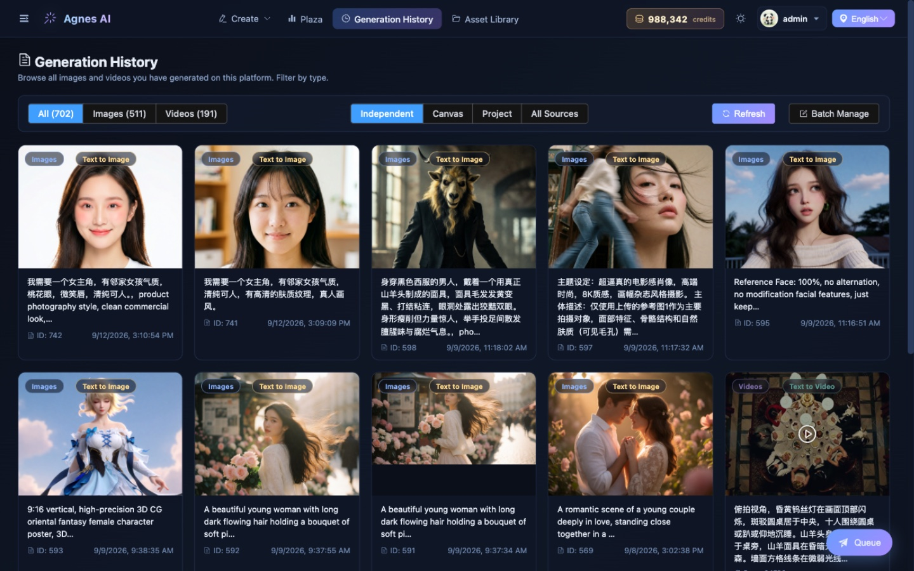
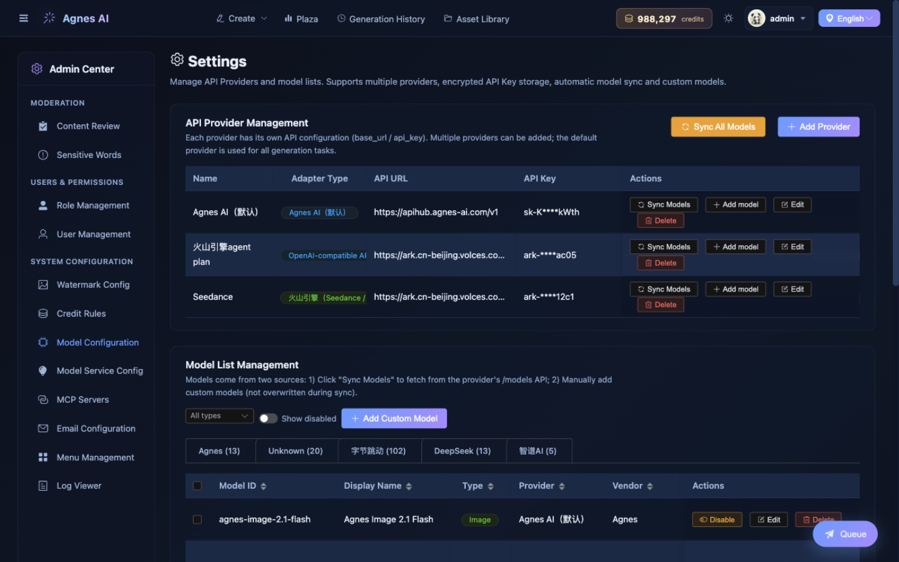

# Agnes AI Platform

  

**🌐 Language / 语言**

[**English** ](README.md) | [中文](README_zh.md)

**An all-in-one AI creation platform — chat with AI, generate images & videos, and compose on an infinite canvas.** Powered by Agnes AI, with a Vue 3 + FastAPI full-stack architecture that keeps your API key secure on the server.

## What Is Agnes AI Platform

Agnes AI Platform is a self-hosted web application that brings together multiple AI capabilities into a single, cohesive experience:

- **AI Chat** — Conversational AI with tool calling. Chat naturally, and the AI can automatically trigger image or video generation when it detects your intent.
- **Image Generation** — Text-to-image and image-to-image, with multiple models and size options.
- **Video Generation** — Text-to-video, image-to-video, and keyframe animation, with async polling and real-time progress.
- **Infinite Canvas** — A free-form workspace where you can place generated images as nodes, connect them, and re-generate or remix with context-aware operations. A built-in Canvas Agent can operate the canvas for you — just describe what you want.
- **Preset Center** — Reusable creation configs (styles, effects, camera moves, prompts, scripts, skills) with cover previews, categories, and one-click apply.
- **Multi-Provider Management** — Add and switch between multiple AI API providers (different base URLs, API keys) from the settings page. No need to edit `.env` files after initial setup.
- **Generation History** — Persistent history with thumbnails, GIF previews, filtering, and batch operations.
- **Community Plaza** — Browse community-shared creations for inspiration, or share your own works.

All API keys are encrypted and stored on the server — they never reach the browser.

## Screenshots

| Infinite Canvas | AI Chat with Tool Calling |
|---|---|
|  |  |
| **Image Generation** | **Preset Center** |
|  |  |
| **Generation History** | **Multi-Provider Management** |
|  |  |

## How We Got Here

Agnes AI Platform started as a simple image & video generation tool. Here's how it evolved:

| Phase | What Changed |
|---|---|
| **v1 — Generator** | Text-to-image, image-to-image, text-to-video, image-to-video. A clean tool with async polling and history. |
| **v2 — Multi-Provider** | Replaced the single `.env` API key with a database-backed provider system. Add, edit, and switch providers from the UI. API keys encrypted at rest. |
| **v3 — AI Chat** | Added a conversational AI interface with tool calling. The AI can detect your intent and trigger image/video generation automatically. Full SSE streaming. |
| **v4 — Infinite Canvas** | Introduced a free-form canvas for composing and remixing generated images. Nodes, connections, mask editing, and context-aware re-generation. |
| **v5 — Agent & Presets** | Canvas Agent that operates the canvas through conversation (create nodes, connect them, batch-generate), a Preset Center for reusable styles/effects/skills, and a community Plaza for sharing creations. |

The platform continues to grow, but the core principle remains the same: **a self-hosted, secure, all-in-one AI creation workspace.**

## Quick Start

### Prerequisites

| Tool | Version | Why |
|---|---|---|
| **Docker** (recommended) | 20+ | Container deployment, no Python/Node needed |
| **Python** | 3.10+ (3.11+ recommended) | Backend runtime (source start) |
| **Node.js** | 18+ (20+ LTS recommended) | Frontend build (source start) |

### 1. Docker / Portable Deployment (Recommended)

The only prerequisite: [Docker](https://docs.docker.com/get-docker/) (the portable packages don't even need Docker).

**Option A: docker run**

```bash
docker run -d --name agnes-platform -p 8080:8000 -v agnes-data:/app/data ghcr.io/wingkysky/agnes-ai-platform:latest
```

**Option B: docker compose** (after cloning the repo, from the repo root)

```bash
docker compose up -d
```

**Option C: Portable packages (no Docker, Windows / macOS)**

Download the zip for your platform from [Releases](https://github.com/WingkySky/Agnes-AI-Platform/releases), extract, and double-click `start-windows.bat` (Windows) or `start-macos.command` (macOS) — the browser opens automatically.

- One-time prompts for unsigned apps are expected: on Windows click "More info → Run anyway" at SmartScreen; on macOS run `xattr -cr <extracted-folder>` in Terminal first (Apple Silicon only — Intel Macs should use Docker or run from source)
- All data lives inside the extracted folder (backup = copy the folder); to upgrade, download the new package and copy your old `backend/` folder over it

Then open http://localhost:8080 and follow the first-run wizard — that's it.

- All data (database / uploads / logs / auto-generated secrets) lives in the `agnes-data` volume. Upgrading = pull the new image and recreate the container, nothing is lost.
- For public server deployment (reverse proxy / HTTPS / backups), see [docs/deployment.md](docs/deployment.md).

### 2. One-Click Start (Without Docker)

Open a terminal in the project root and run:

```bash
# macOS / Linux — first time: grant execute permission
chmod +x start.sh
./start.sh

# Windows
start.bat

# Or use the Python launcher (cross-platform, no permission needed)
python start.py
```

> **macOS / Linux first run**: Shell scripts (`.sh`) downloaded from Git or copied between machines may not have execute permission. Run `chmod +x start.sh` once before the first `./start.sh`. If you skip this, you'll get a "permission denied" error.
>
> **macOS Gatekeeper**: If macOS blocks the script with "cannot be opened because it is from an unidentified developer", go to **System Settings → Privacy & Security** and click "Open Anyway", or run `xattr -d com.apple.quarantine start.sh` in Terminal.
>
> **Windows**: `.bat` files run directly without extra permission. If Windows SmartScreen blocks it, click "More info → Run anyway".

This automatically starts both the backend and frontend in one command. On first run it will create `.env` from the example (auto-generating random `JWT_SECRET` / `ENCRYPTION_KEY` if missing), initialize the database with all official seed data, and open the browser.

> **First-Run Wizard**: No default account exists. The first time you open the app you'll be guided to create your own admin account (pick your username and password) and connect an AI model service — generation works as soon as that's done. You can complete the same setup later from Admin → Model Config if you skip it.
>
> **Automated deployments**: set both `ADMIN_USERNAME` and `ADMIN_PASSWORD` before first start to pre-provision the admin instead (optional `ADMIN_EMAIL` / `ADMIN_CREDITS`). When these are set, the account-creation step is skipped.

### 3. Manual Start

#### Backend

```bash
cd backend

# Create virtual environment
python -m venv .venv
source .venv/bin/activate      # macOS / Linux
# Windows: .venv\Scripts\activate

# Install dependencies
pip install -r requirements.txt

# Configure environment
cp .env.example .env
# Optional: set AGNES_API_KEY to auto-create a default provider on first launch.
# JWT_SECRET / ENCRYPTION_KEY are auto-generated by ./start.sh if left empty.
# After first launch, you can manage providers from the frontend settings page.
```

Start the backend (macOS/Linux):

```bash
./start.sh
```

Start the backend (Windows):

```batch
start.bat
```

Or manually:

```bash
# Generate secrets into .env first (skipped when already configured)
python ensure_secrets.py
python -m uvicorn app.main:app --host 0.0.0.0 --port 8000 --reload
```

Verify: http://localhost:8000/health or http://localhost:8000/docs

#### Frontend

Open a **new terminal**:

```bash
cd frontend

# Install dependencies
npm install

# Start dev server (port 5174, auto-proxies /api → backend:8000)
npm run dev
```

Visit http://localhost:5174 — you're ready to go.

### 4. First-Time Setup

1. Log in and the **setup wizard** opens automatically — change the default password, and add an AI provider if none exists (skippable).
2. Your `.env` API key (if set) is automatically loaded as the default provider on first launch.
3. All official content (preset center styles/effects/cameras/skills, pipeline templates, built-in roles & credit rules) is seeded automatically at startup.
4. Add more providers anytime in **Admin → Model Config** — each with its own base URL and API key.
5. Start creating — chat, generate images/videos, or open the canvas.

## Tech Stack

| Layer | Technology |
|---|---|
| Frontend | Vue 3 (Composition API) + Vite + TypeScript + Vue Router + Pinia + Element Plus |
| Backend | Python 3.10+ · FastAPI · SQLAlchemy 2.0 (async) · httpx (async HTTP client) |
| Database | SQLite (default, zero-config) / PostgreSQL (optional) |
| AI Provider | AIBridge SDK (38+ providers: Agnes, OpenAI, Anthropic, Claude, Gemini, Qwen, DeepSeek...) |

## FAQ

**Q: Why a BFF layer instead of calling the AI API directly from the browser?**

A: Two reasons — (1) your API key stays on the server and never reaches the browser, (2) the server handles async task polling, history persistence, and media processing that a pure frontend can't do reliably.

**Q: How long does video generation take?**

A: Usually 2–6 minutes. The platform polls in the background — you can navigate away and check back later.

**Q: Can I use other OpenAI-compatible APIs?**

A: Yes. Add a new provider in Settings with your custom base URL and API key. The platform supports any OpenAI-compatible chat, image, and video endpoints.

**Q: Can I deploy this to production?**

A: Yes. Build the frontend (`npm run build`) and serve it statically. Deploy the backend with any ASGI host. Set `FRONTEND_ORIGINS` and `DATABASE_URL` for your production environment.

## License

Apache License 2.0 with Commons Clause — source code is open and free to use for personal, educational, and research purposes. **Commercial use is prohibited.** See [LICENSE](LICENSE) for details.
